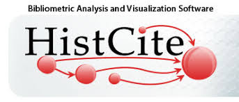

# HistCite-Turior

## HistCite快速定位核心文献

### 1. HistCite 简介

如果你学习了一些文献检索技巧，并已经开始进行文献调研，相信你一定会碰到一个头疼的问题，那就是面对海量的文献，如何才能找到对自己最有价值的那部分文献，而不要把精力浪费在哪些低价值，或是对自己参考意义不大的文献上，这就要求我们用一定的方法找出重要的文献来。

在自己亲自阅读大量的文献之前，显然你是无法直接知道未读文献质量的，所以，我们筛选的标准只能是根据别人的意见或者是依据某些客观的指标。如同我们在网购时，需要根据别人的评价一样。文献的评价在哪里呢？一个作者对一篇文献的好评就是引用它，所以引用可以看作是作者对前人工作的肯定，或者是投票。如果你看过一些娱乐节目的评分形式，也许会知道，通常一个选手会有两部分人参与评分，一是大众评委，一是专家评委。显然这两部分人的评价标准是不同的，
一部分人只是看热闹，一部分人能给出合理专业的评价。

如果把论文引用看成是评价的话，这种评价也会来自两部分人群。一是引用这篇文献的作者，恰好也是你的同行；另一部分引用该文章的作者不是你的同行，他们引用的原因可能和你感兴趣的点截然不同。非同行认为很好的文献，对你通常并没有任何参考价值。这就是很多引用次数很高的文献，对你却没有任何参考价值的原因。在阅读之前，要想知道一篇文章的质量高低，你同行的意见最具有参考价值。如何找出你同行认为最有价值的文献呢，这就是 HistCite 软件所要实现的功能。

HistCite＝History of Cite，意味引文历史，或者叫引文图谱分析软件。该软件系 SCI 的发明人加菲尔德开发，能够用图示的方式展示某一领域不同文献之间的关系。可以快速帮助我们绘制出一个领域的发展历史，定位出该领域的重要文献，以及最新的重要文献。HistCite 的分析步骤包括两步：

①首先通过检索，将文献限定在某一个主题范围内，这样搜到的文献都是你感兴趣额的文献。这时候文献数量可能还会很大，超出阅读范围；即便数量不大，也没法直接看出这些文献之间的关联；

②利用 HistCite 对检索到的文献进行分析，找出同行推荐的最重要的文献；这些文献通常就是一个领域发展的里程碑式的文献。

这就是 HistCite 分析的简要过程。当然，在此基础上，HistCite 还可以给我们提供更多的信息。如找出关键词遗漏的文献；重要的国家、机构和科学家；发展趋势；最新进展等。

### 2. 教程主要内容：

| 章节 | 名称 | 内容 |
|:----------:|:------------------------:|:----------------------------------:|
| 第1章 | HistCite 简介 | 背景介绍 | 
| 第2章 | 常规的文献筛选方法 | 基于数据库的分析  基于文献管理软件的分析 |
| 第3章 | HistCite 的使用步骤 | 从 Web of Science 数据库下载数据 数据导入 HistCite  作图分析(make graph) |
| 第4章 | HistCite 的分析原理 | HistCite 的分析原理 |
| 第5章 | HistCite 的详细介绍 | 数据下载与导入 软件的界面  HistCite 作图界面 HistCite 菜单详解 |
| 第6章 | HistCite 查找遗漏文献 | 查找遗漏文献 |
| 第7章 | 使用 HistCite 的常见问题 | 使用 HistCite 的常见问题 |
| 第8章 | 我的使用场景 | HistCite的使用场景建议方法 |

### 3. HistCite 资源：

- [PDF教程](https://pan.baidu.com/s/1zJn3ku8flRqIwPe4yjl6CA) | 提取码：iuvy
- [网页版教程](https://mp.weixin.qq.com/s?__biz=MzU1OTE2NzQyMQ==&mid=2247483732&idx=1&sn=cc73151333b2c2c71c63e6cc22413889&chksm=fc1a2386cb6daa905cf8fc4b8f628f55873384304cda3ab9ce12cbf763ce97ba57632128cdc1&token=666505522&lang=zh_CN#rd)
- [HistCite-Windows 软件下载](https://pan.baidu.com/s/1zJn3ku8flRqIwPe4yjl6CA) | 提取码：iuvy
- 如果您觉得有帮助, 请在右上角**star**本项目, 您的“点赞”就是对我最大的支持！ 更多资源请关注**微信公众号**：[BreakIntoAI](https://weixin.sogou.com/weixin?type=1&s_from=input&query=BreakIntoAI&ie=utf8&_sug_=n&_sug_type_=)
